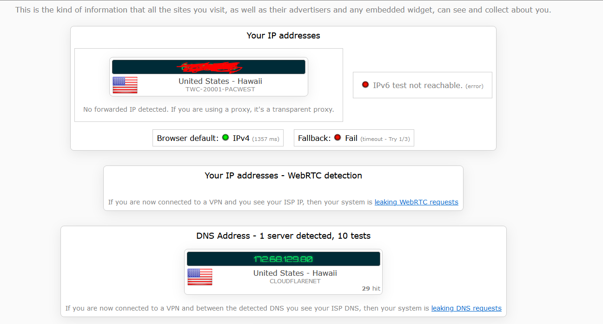
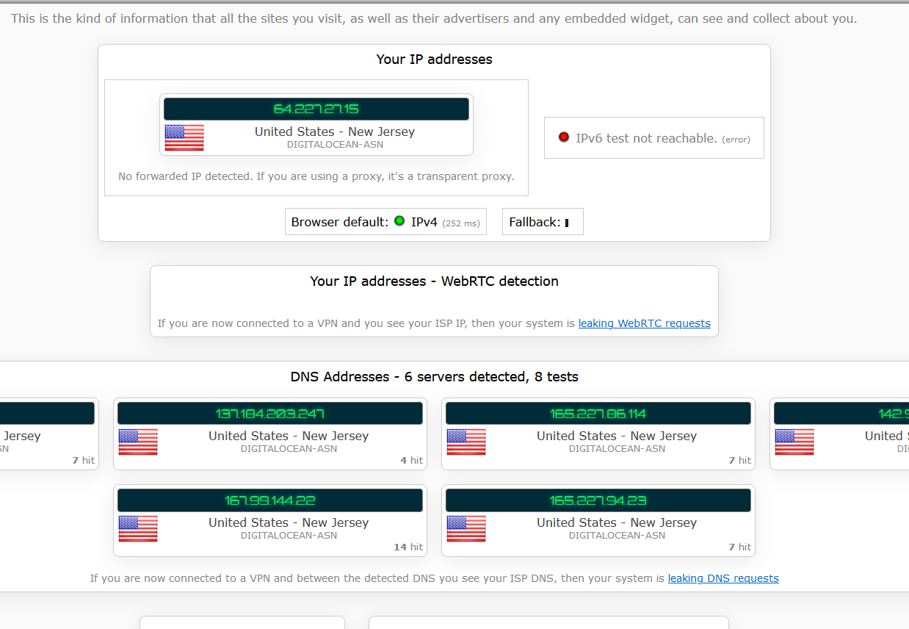

# Create a Droplet on Digital Ocean
Go to DigitalOcean and create a project. After creating the project, create a droplet.
The Region chosen does not matter.
The droplet used for this project ran on Ubuntu 22.04 (LTS) x64 and the plan used was the Regular intel CPU @ $4/month
Add the password (or use SSH) and create the droplet 

## Creating a User 
Inside the console of the Droplet, run the following commands

adduser (your name)
- this will create a user, fill out the information if wanted

usermod -aG sudo (your name)
- this will grant the user with administrative privileges

sudo su (your name)
- this will let you access the console from the user you just created

# Install Docker
Go to this [link](https://docs.docker.com/get-docker/) and follow the instructions to install Docker

Run the command:
sudo apt install docker-compose
- this will install docker to the droplet

# Wireguard Setup
Run these commands after installing Docker

mkdir -p ~/wireguard/
mkdir -p ~/wireguard/config/
nano ~/wireguard/docker-compose.yml

- this will create a directory for wireguard and the wireguard config and allow you to create a file to edit

Copy and paste the content below into the docker-compose.yml file :
``` version: '3.8'
services:
  wireguard:
    container_name: wireguard
    image: linuxserver/wireguard
    environment:
      - PUID=1000
      - PGID=1000
      - TZ=Asia/Hong_Kong
      - SERVERURL=1.2.3.4
      - SERVERPORT=51820
      - PEERS=pc1,pc2,phone1
      - PEERDNS=auto
      - INTERNAL_SUBNET=10.0.0.0
    ports:
      - 51820:51820/udp
    volumes:
      - type: bind
        source: ./config/
        target: /config/
      - type: bind
        source: /lib/modules
        target: /lib/modules
    restart: always
    cap_add:
      - NET_ADMIN
      - SYS_MODULE
    sysctls:
      - net.ipv4.conf.all.src_valid_mark=1
``` 
Change the SERVERURL to your DigitalOcean Droplet's IP address
Change PEERS and TZ if needed

## Starting Wireguard
cd into the wireguard directory created earlier

Run the following command to run the scripts to start Wireguard:
sudo docker-compose up -d

When the output says that the creation of Wireguard is done, run this command

sudo docker-compose logs -f wireguard
- this will create an execution log and the QR code of the Wireguard VPN

You will know it works when there is a big QR code in the output


## Locating Config File
To get the config file, you will have to SFTP into the droplet 
I used CyberDuck
- For the server, use the IP address of the droplet
- For the username, use the name of the user you created
- I left the SSH port on default at port 22 but this is not recommended

After downloading the config file, go into the peer_(name) folder and look for the .conf file inside


# Running the VPN 
Download Wireguard [here](https://www.wireguard.com/install/)
Make sure the DigitalOcean droplet is active

After Wireguard is done downloading, add a tunnel and select the .conf file you located earlier

Before activating the tunnel, note your IP address at [ipleak.net](ipleak.net)


Activate your tunnel and take a note of the new IP address



