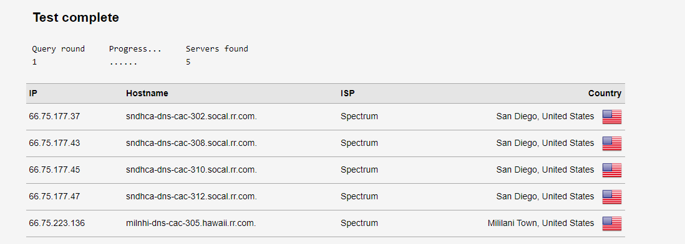
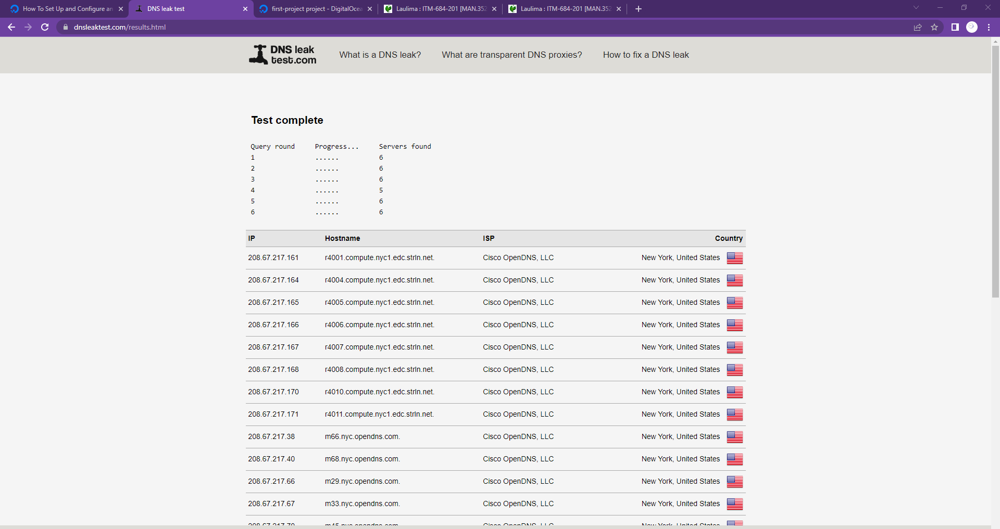
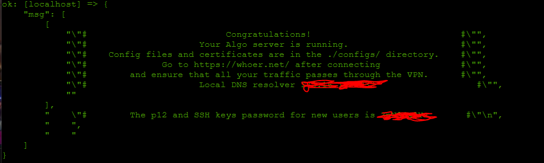
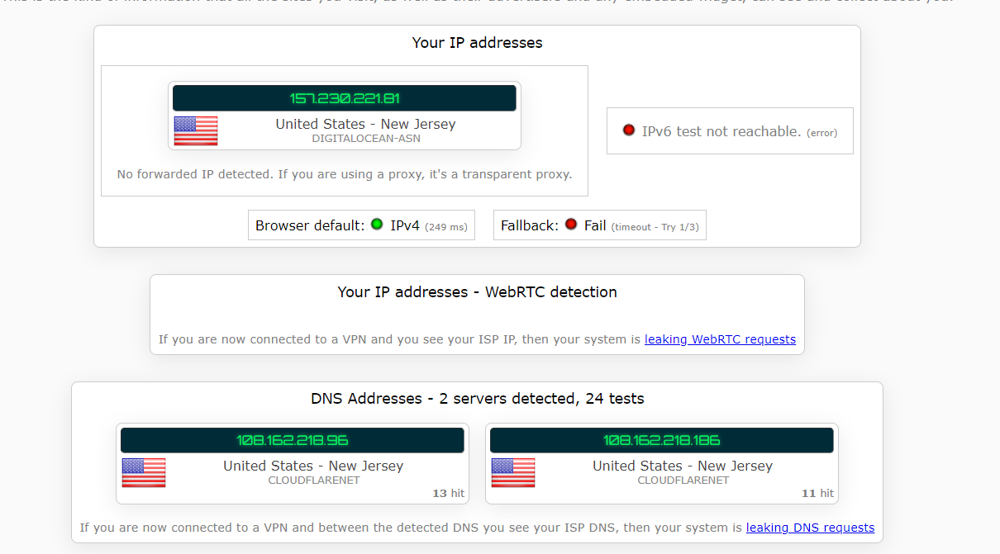

# Prerequisites
You will need to create two separate droplets for your VPN server. One will host the Certifcate Authority (CA) and the other will host the VPN.
## Initial Server Setup with Ubuntu 22.04
The Region chosen does not matter.
The droplet used for this project ran on Ubuntu 22.04 (LTS) x64 and the plan used was the Regular intel CPU @ $4/month
Add the password (or use SSH) and create the droplet 

After creating the Droplet, access the console to create the users.

Run the following:
- ssh root@your_server_ip (log into your server as the root account)
- adduser [name] (this will be the user for your server)
- usermod -aG sudo [name] (this will give the user administrative privileges)

After creating the users and giving them access, you will have to set up the Firewall

- ufw allow OpenSSH (this will allow OpenSSH to pass through your firewall)
- ufw enable (this will enable your firewall) press y and enter to proceed
- Check the firewall by running the command: ufw status

SSH into the new user account by running the command:
- ssh [name]@[your_server_ip]

This will log you into the user account. If you need to run a command with administrative privileges, type sudo before the command

## How To Set Up and Configure a Certificate Authority On Ubuntu 22.04
YOU WILL NEED TO HAVE MADE ANOTHER SERVER BEFORE STARTING THIS

Create another Droplet using the same configurations as mentioned previously
Login to your CA Server as the non-root sudo user that you created during the initial setup steps and run the following:
- sudo apt update
- sudo apt install easy-rsa

This will install the easy-rsa packages as well as updating any other packages needed

Run the following command to create a directory for your PKI
- mkdir ~/easy-rsa

You will then create a symbolic link pointing to the easy-rsa packages installed earlier
- ln -s /usr/share/easy-rsa/* ~/easy-rsa/

To restrict access to your new PKI directory, ensure that only the owner can access it using the chmod command:
- chmod 700 /home/[name]/easy-rsa

Go into the easy-rsa directory and run the following command to initialize the PKI
- ./easyrsa init-pki

Stay in the easy-rsa directory and run the command:
- nano vars (creates a file named vars)
Paste the following information into the file and change it to fit your information
```set_var EASYRSA_REQ_COUNTRY    "US"
set_var EASYRSA_REQ_PROVINCE   "NewYork"
set_var EASYRSA_REQ_CITY       "New York City"
set_var EASYRSA_REQ_ORG        "DigitalOcean"
set_var EASYRSA_REQ_EMAIL      "admin@example.com"
set_var EASYRSA_REQ_OU         "Community"
set_var EASYRSA_ALGO           "ec"
set_var EASYRSA_DIGEST         "sha512" 
```
Exit out of the file by pressing CTRL-X, Y, then ENTER to confirm

Run the following command to create the public and private key pair for your CA
- ./easyrsa build-ca

Fill out the information regarding the common name for your CN, for simplicity, you can just press ENTER to accept the default name
Running this script will also create two very important files for your server
ca.crt is the CA’s public certificate file
ca.key is the private key that the CA uses to sign certificates for servers and clients

Go into your ca.crt file by running the command:
- cat ~/easy-rsa/pki/ca.crt

There will be an output in your terminal similar to the following:
```
-----BEGIN CERTIFICATE-----
MIIDSzCCAjOgAwIBAgIUcR9Crsv3FBEujrPZnZnU4nSb5TMwDQYJKoZIhvcNAQEL
BQAwFjEUMBIGA1UEAwwLRWFzeS1SU0EgQ0EwHhcNMjAwMzE4MDMxNjI2WhcNMzAw
. . .
. . .
-----END CERTIFICATE----- 
```
Copy and paste all of that text (including begin and end certificate with the dashes)

In the other server that you created, run this command to create a filed called ca.crt
- nano /tmp/ca.crt

Paste the contents into that file and save it.

Staying on this server, run the following commands to iport the certificate from the CA server:
- sudo cp /tmp/ca.crt /usr/local/share/ca-certificates/
- sudo update-ca-certificates

# Installing OpenVPN and Easy-RSA
By now, you should have both servers created 

## Installing OpenVPN and Easy-RSA
Install OpenVPN and Easy-rsa
- sudo apt update
- sudo apt install openvpn easy-rsa

Create a directory for easy-rsa
- mkdir ~/easy-rsa

Create a symlink from the easyrsa script into the directory just created
- ln -s /usr/share/easy-rsa/* ~/easy-rsa/

Make the owner of the directory your non-root sudo user
- sudo chown [name] ~/easy-rsa
- chmod 700 ~/easy-rsa

## Create a PKI for OpenVPN
Go to easy-rsa directory and create a file named vars and paste the following text into the file 
```set_var EASYRSA_ALGO "ec"
set_var EASYRSA_DIGEST "sha512" 
```

Save and exit the file. Then run the following script to create another PKI directory:
- ./easyrsa init-pki

## Create OpenVPN Certificate Request and Private Key
Navigate to the easy-rsa directory in your VPN server
Call the easyrsa script with the gen-req followed by the common name you saved earlier. If you used the default name, it will be server. The no-pass argument will not require you to put the password in multiple times
- ./easyrsa gen-req server nopass

Copy the server key created by the script into the openvpn/server directory
- sudo cp /home/[name]/easy-rsa/pki/private/server.key /etc/openvpn/server/

## Signing the OpenVPN Server's Certificate Request
You will need to have both the CA server and VPN server for this step and the upcoming steps

Open the VPN server and use scp (or any other transfer method) to copy the server.req certificate request to the CA server for signing. Remember to use the IP address of your CA server
- scp /home/[name]/easy-rsa/pki/reqs/server.req [name]@your_ca_server_ip:/tmp

On the CA Server, navigate to the easy-rsa directory and run the following script to import the certificate request
- ./easyrsa import-req /tmp/server.req server

The script should leave a message saying that the request has been successfully imported

Run the easy-rsa script with the sign-req option followed by the request type and common name
- ./easyrsa sign-req sever server

Say yes and press enter to confirm the prompts

To finish configuring the certificates, copy the server.crt and ca.crt files from the CA server to the OpenVPN server
- scp pki/issued/server.crt [name]@your_vpn_server_ip:/tmp
- scp pki/ca.crt [name]@your_vpn_server_ip:/tmp

Back on your VPN server, copy the files from /tmp to /etc/openvpn/server
- sudo cp /tmp/{server.crt,ca.crt} /etc/openvpn/server

## Configuring OpenVPN Cryptographic Material
On your VPN server, cd into your easy-rsa directory and generate the tls-cryp pre-shared key
- openvpn --genkey --secret ta.key

Copy the file ta.key into /etc/openvpn/server
- sudo cp ta.key /etc/openvpn/server

## Generating a Client Certificate and Key Pair
Create a directory to store the client certificate and key files and lock down its permissions in case
- mkdir -p ~/client-configs/keys
- chmod -R 700 ~/client-configs

Go back to the easy-rsa directory and run the following script
- ./easyrsa gen-req client1 nopass

Copy the client1.key file to the directory created earlier and transfer the file to your CA server
- scp pki/private/client1.key ~/client-configs/keys/
- scp pki/reqs/client1.req [name]@your_ca_server_ip:/tmp

On your CA server, navigate to the easy-rsa directory and import the certificate request
- ./easyrsa import-req /tmp/client1.req client1

Sign the request and enter yes to the prompt. Transfer the file created back to the VPN server
- ./easyrsa sign-req client client1
- scp pki/issued/client1.crt [name]@your_server_ip:/tmp

Back on the VPN server, copy the client certificate to the clinet-configs directory
- cp /tmp/client1.crt ~/client-configs/keys/

Copy the ca.crt and ta.key files to the client configs directory as well and set the appropriate permissions for it
- cp ~/easy-rsa/ta.key ~/client-configs/keys/
- sudo cp /etc/openvpn/server/ca.crt ~/client-configs/keys/
- sudo chown [name].[name] ~/client-configs/keys/*

## Configuring OpenVPN
Copy the server.conf file as a starting point for your own configuration file
- sudo cp /usr/share/doc/openvpn/examples/sample-config-files/server.conf /etc/openvpn/server/

Open the file
- sudo nano /etc/openvpn/server/server.conf

You will need to look for the following sections and change them. The [] will indicate that this was added to the file
```
[;]tls-auth ta.key 0 # This file is secret
[tls-crypt ta.key]
```
```
[;]cipher AES-256-CBC
[cipher AES-256-GCM]
[auth SHA256]
```
```
[;]dh dh2048.pem
[dh none]
```
Uncomment the user nobody and group nogroup lines by removing the ;

Change the port number and protcol if necessary, for the sake of this project, I used port 41325. If you decide to switch the protocol to TCP, you will need to change the ```explicit-exit-notify``` value from 1 to 0

Save and exit the file

## Adjusting OpenVPN Server Networking Configuration
Adjust OpenVpn's default IP forwarding setting by opening the sysctl.conf file
- sudo nano /etc/sysctl.conf

Add this line at the bottom of the file and save and exit after
- net.ipv4.ip_forward = 1

## Firewall Configuration
Find the public network interface of your machine
- ip route list default
Look for the word that comes after "dev" and keep note of that as it is your public interface. An example output would look like
```
default via 159.65.160.1 dev [eth0] proto static
```
Open the before.rules file to add the relevant configuration
- sudo nano /etc/ufw/before.rules
Place the public interface into this area within the file:
```
# START OPENVPN RULES
# NAT table rules
*nat
:POSTROUTING ACCEPT [0:0]
# Allow traffic from OpenVPN client to eth0 (change to the interface you discovered!)
-A POSTROUTING -s 10.8.0.0/8 -o eth0 -j MASQUERADE
COMMIT
# END OPENVPN RULES
```
You will now need to tell the UFW to allow forwarded packets by default as well
- sudo nano /etc/default/ufw

Change the value from DROP to ACCEPT

Next you will need to modify your UFW to allow the ports that you specified earlier. Allowing 443 and 53 will also ensure traffic will never get blocked
- sudo ufw allow 443/tcp
- sudo ufw allow 53/udp
- sudo ufw allow 41325/tcp
- sudo ufw allow OpenSSH

Restart your UFW
- sudo ufw disable
- sudo ufw enable

## Starting OpenVPN
Enable the OpenVPN service to start up at boot so you can connect to the VPN whenever the server is running
- sudo systemctl -f enable openvpn-server@server.service

Then start the OpenVPN Service

- sudo systemctl start openvpn-server@server.service

You can verify the service is active by running this command

- sudo systemctl status openvpn-server@server.service

## Creating Client Configuration Infrastructure
Create a directory within the client-configs directory to store client configuration files
- mkdir -p ~/client-configs/files
Copy an example client config file into the directory to use as your base configuration
- cp /usr/share/doc/openvpn/examples/sample-config-files/client.conf ~/client-configs/base.conf
- open the file
Locate the "remote" directive and add your VPN server's IP along with the port you specified earlier to listen on. Make sure the protcol also matches if you changed the port

Remove the ; next to the user nobody and group nogroup directives

Find the directives that set the ca, cert, and key and add a ; in front of them to comment them out

Comment out the tls-auth directive as well

Use the cipher and auth settings from your server.conf file from earlier
- cipher AES-256-GCM
- auth SHA256

Add the key-direction anywhere in the file and set it to 1
 
- key-direction 1
Add a few commented out lines to handle various methods that linux baed VPN clients use for DNS resolution. The first one will be for clients that do NOT use systemd-resolved and the second one will be for clients that DO use it
```
; script-security 2
; up /etc/openvpn/update-resolv-conf
; down /etc/openvpn/update-resolv-conf
```
```
; script-security 2
; up /etc/openvpn/update-systemd-resolved
; down /etc/openvpn/update-systemd-resolved
; down-pre
; dhcp-option DOMAIN-ROUTE .
```
Exit the file and create a script that will compile your base configuration with the relevant certificate, key, and encryption files
- nano ~/client-configs/make_config.sh
 Add the following content inside the file
 ```
 #!/bin/bash
 
# First argument: Client identifier
 
KEY_DIR=~/client-configs/keys
OUTPUT_DIR=~/client-configs/files
BASE_CONFIG=~/client-configs/base.conf
 
cat ${BASE_CONFIG} \
    <(echo -e '<ca>') \
    ${KEY_DIR}/ca.crt \
    <(echo -e '</ca>\n<cert>') \
    ${KEY_DIR}/${1}.crt \
    <(echo -e '</cert>\n<key>') \
    ${KEY_DIR}/${1}.key \
    <(echo -e '</key>\n<tls-crypt>') \
    ${KEY_DIR}/ta.key \
    <(echo -e '</tls-crypt>') \
    > ${OUTPUT_DIR}/${1}.ovpn
```
After saving the file, mark the file as an executable
- chmod 700 ~/client-configs/make_config.sh

## Generating Client Configurations
Navigate into the client-configs directory and run the script you just created
- ./make_config.sh client1

This will create a file called client1.ovpn inside your ~/client-configs/file directory

You will need to transsfer this file to whatever device you plan to use the VPN on. You can run the following sftp command to retrieve the file but you can also use a file sharing program like CyberDuck
- sftp [name]@openvpn_server_ip:client-configs/files/client1.ovpn ~/

Download (OpenVPN)[https://openvpn.net/community-downloads/]
Copy the file that you retrieved from SFTP and paste it into the config file inside the OpenVPN folder

Run OpenVPN and press connect once you have added the file to the folder. The VPN should now work, you can test it using an IP checker. I used (dnsleaktest.com)[dnsleaktest.com] but you can also use (ipleak.net)[ipleak.net]

Before: 


After:


# AlgoVPN Installation
To install AlgoVPN on your server, you must firstg get a copy of Algo and install its core dependencies
- git clone https://github.com/trailofbits/algo.git
- sudo apt install -y --no-install-recommends python3-virtualenv

Install Algo's remaining dependencies. You will need to run this inside the algo directory that was created from the previous installations
```python3 -m virtualenv --python="$(command -v python3)" .env &&
  source .env/bin/activate &&
  python3 -m pip install -U pip virtualenv &&
  python3 -m pip install -r requirements.txt
  ```
Open the config.cfg file and specify the users in the users list. Make sure to change the ssh ports and wireguard ports.

Run the deployment 
- sudo ./algo

Make sure to choose 12 when prompted to pick a service
Fill out the remaining information
You should be prompted with a congratulations screen after you are done


SFTP into the server and retrieve the configs folder from the algo directory

Download (wireguard)[https://www.wireguard.com/install/]

Inside the configs folder, there will be a file with a .conf ending. Import this file into your wireguard tunnel and activate the tunnel. The VPN should activate. To test this, I went on (ipleak.net)[ipleak.net]

Before:


After:



